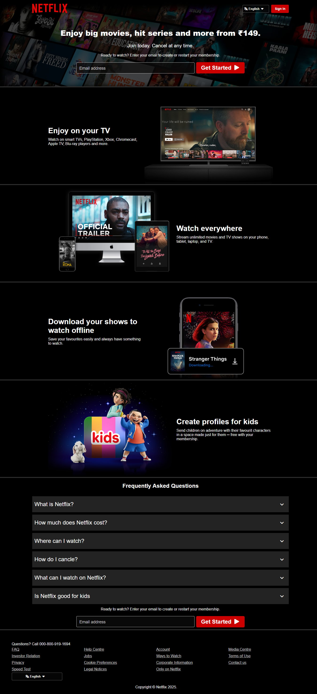

## Screenshots

### Landing Page

# streaming-landing-clone
This repo is an educational landing page clone inspired by modern streaming service layouts. It is built for practice and UI replication only — not affiliated with or endorsed by Netflix.

Description:
This repo is an educational landing page clone inspired by modern streaming service layouts. It is built for practice and UI replication only — not affiliated with or endorsed by Netflix.

Live demo: (https://code-with-mahir.github.io/streaming-landing-clone/)

Features:
Full-width hero with CTA
Responsive content rows (carousel-like static layout)
Sign-in/Sign-up modal (mock)
Footer with legal-like links (static)
Accessibility basics (semantic HTML, keyboard focus)

Tech Stack:
HTML5
CSS3 (Grid + Flexbox)

Usage:
Customize content in index.html and styles in styles.css.
Use royalty-free or self-created images. Avoid official Netflix logos or copyrighted show artwork.

Important Notice / Disclaimer
For educational use only. This project is not an official Netflix product.

Contribution

PRs are welcome. Keep all assets and text original or properly licensed.
